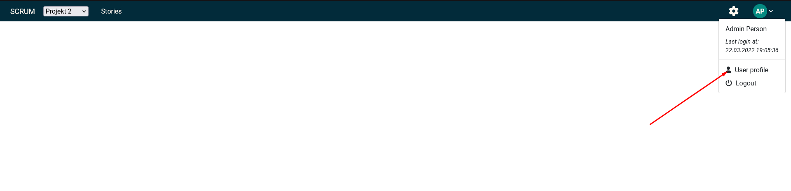

# Uporabniški profil

## Uporaba

Do uporabniškega profila se dostopa tako, da izberemo ikono uporabnika, nato pa v spustnem meniju izberemo `User profile`:

Nato imamo na voljo dva obrazca:
* Uporabniški profil, ki omogoča spreminjanje podatkov o uporabniku
* Obrazec za zamenjavo gesla, v katerega moramo vnesti trenutno geslo, novo geslo ter ponoviti novo geslo.